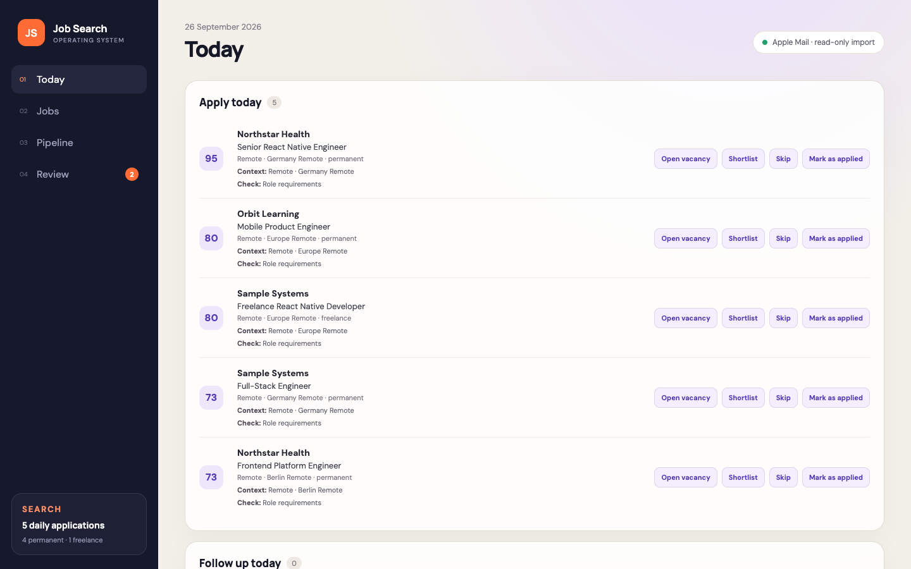
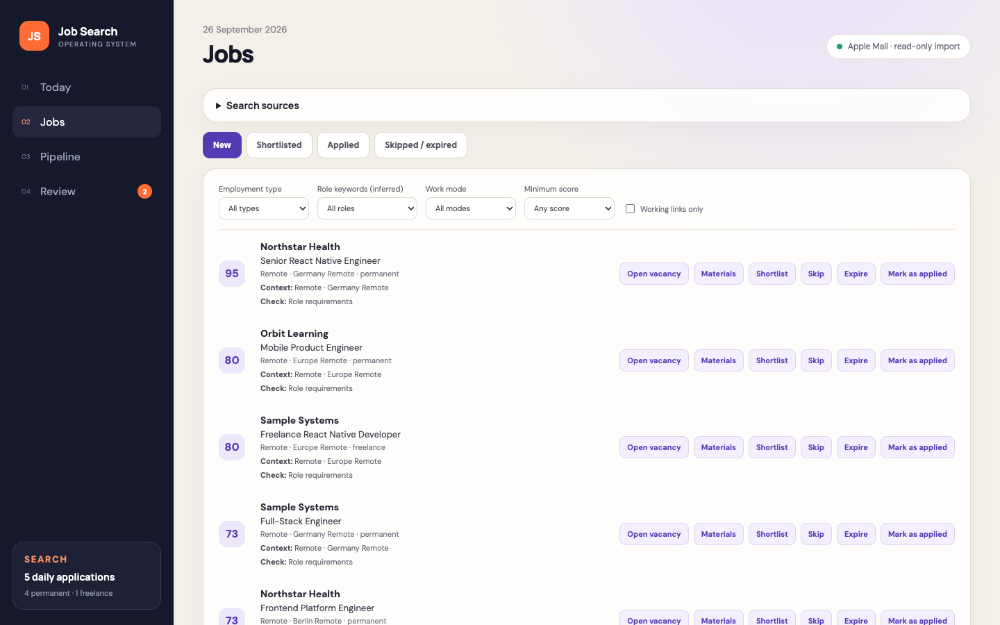
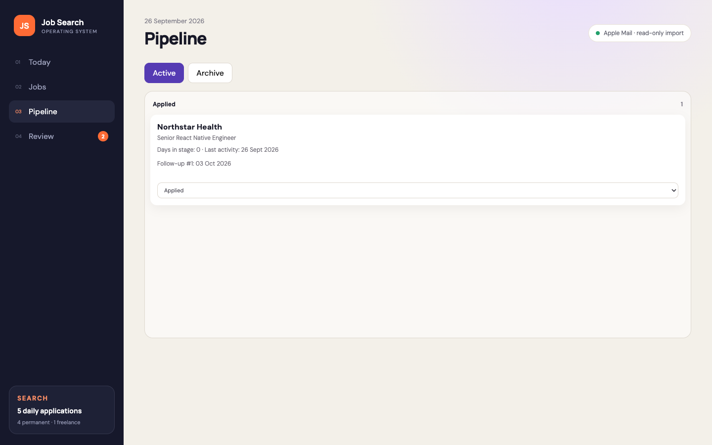
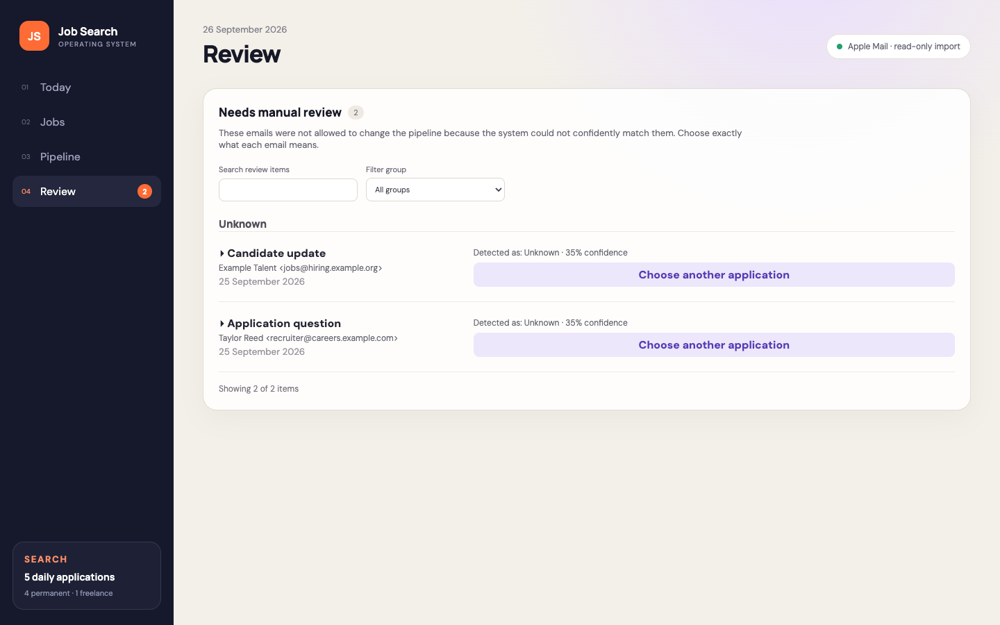

# Job Search OS

A local job-search dashboard for reviewing leads, tracking applications, preparing resumes, and opening follow-up drafts. It stores application records and imported email evidence in local SQLite storage. You review documents and send messages yourself.

## Demo

Every company, vacancy, contact, and application shown below is fictitious.

| Prioritize today's work                                                                        | Review and triage jobs                                                                |
| ---------------------------------------------------------------------------------------------- | ------------------------------------------------------------------------------------- |
|          |      |
| **Track the active pipeline**                                                                  | **Resolve uncertain email evidence**                                                  |
|  |  |

## Privacy and prerequisites

The included candidate Alex Morgan, vacancies, and contacts are fictitious. Use fictitious data only in screenshots, demos, fixtures, and public discussions. Mail imports, personal configuration, databases, backups, and generated documents belong to the person running the app and must stay outside Git.

Requires Node.js 24 and npm. Apple Mail integration requires macOS, Apple Mail, and macOS automation permission. Resume generation requires Python with `python-docx` and LibreOffice (`soffice`); set `DOCUMENT_PYTHON` and `DOCUMENT_SOFFICE` to select executable paths if needed. The core dashboard and automated tests can run without Apple Mail or the document tools.

## Setup

```sh
npm ci
cp config/example.json config/local.json
# Edit the ignored config/local.json before importing your own data.
npm run seed
npm run dev
```

Vite prints the development URL. The API binds to loopback; the production app defaults to `http://127.0.0.1:4174`. Keep it on your own computer. `PORT` selects the API port. `JOB_SEARCH_CONFIG` selects a different JSON configuration; the default is `config/local.json`. Keep alternate personal configuration outside the repository or under an ignored local filename.

## Configuration

Copy the complete structure from `config/example.json`. Configuration is validated on startup; missing or invalid configuration stops the app. There is no fallback to a personal profile.

| Section     | Fields and purpose                                                                                                                                                                                                                                                                                                                                                                                                                                                                                              |
| ----------- | --------------------------------------------------------------------------------------------------------------------------------------------------------------------------------------------------------------------------------------------------------------------------------------------------------------------------------------------------------------------------------------------------------------------------------------------------------------------------------------------------------------- |
| `candidate` | `filenameStem` names generated files using letters, digits, underscores, or hyphens; `signature` supplies follow-up text. `resumes.English` and `resumes.German` supply `name`, `contactLine`, mobile/web headlines, summaries and skills, `careerNote`, experience (`role`, `company`, `dates`, `bullets`), education, and languages.                                                                                                                                                                          |
| `mail`      | `accounts` lists approved Apple Mail account names or addresses; `senderAddresses` lists your allowed sender identities; `initialSyncDate` is the initial import start date in YYYY-MM-DD form. Later imports use the saved cursor unless a date is supplied.                                                                                                                                                                                                                                                   |
| `search`    | `preferredKeywordGroups` defines labels, required `allOf` terms, optional `anyOf` alternatives and scores. `locations`, `seniorityKeywords`, and `acceptedLanguages` guide filtering. `excludeSponsorshipRequired`, `permanentMinSalary`, and `freelanceMinDayRate` express your policy. `dailySelection` reserves permanent/freelance slots within `total`. `sources` defines unique `seedKey`, display `name`, HTTP(S) `searchUrl` without credentials, and `category` (`permanent`, `freelance`, or `both`). |
| `storage`   | `dataDir` owns the SQLite database and local state; `outputDir` owns generated resumes. Relative directories resolve from the current working directory. Default `data/` and `output/` directories are ignored. If you choose other locations, keep them outside Git.                                                                                                                                                                                                                                           |

## Commands

```sh
npm run dev                         # API and web development servers
npm run build                       # TypeScript API and production web build
npm start                           # Serve the production app after building
npm run seed                        # Populate local storage with fictitious examples
npm run sync:mail                    # Read approved Apple Mail accounts
npm run sync:mail -- 2026-01-01      # Override the import start date
npm run import:mail-file -- <file>   # Import a local mail export
npm run import:jobs -- <file>        # Import local job input
npm run sources:list                # List configured search sources
npm run sources:record -- <id> <success|error> <discovered> <imported> <ISO-time> [error]
npm test
npm run lint
npm run privacy:audit
```

Source recording stores the outcome of a search you performed; it does not scrape or submit applications automatically. Keep imported files and recorded error messages private.

## Apple Mail and sending

Mail synchronization reads candidate messages in approved accounts and copies evidence into local storage. It does not send, move, delete, flag, or mark source messages. A follow-up action can open a native reply draft after checking the account, mailbox, recipient, and sender identity. You copy/review the follow-up text, check the recipient and attachments, and explicitly send in Apple Mail. The app never sends mail automatically.

## Public release safeguards

The privacy audit checks tracked working files, staged blobs, all reachable commits and blobs, and annotated tag metadata. It rejects local artifacts, unexpected binary content, absolute user paths, non-example email domains, possible credentials/private keys, and commit identities outside GitHub noreply addresses. Allowed public email domains are `example.com`, `example.org`, `example.net` (including their subdomains), and `users.noreply.github.com`.

Set `PRIVATE_DENYLIST_PATH` in your shell to an external file containing one private identifier per line (blank lines and lines starting with `#` are ignored). Set `ALLOWED_AUTHOR_EMAIL` to enforce a single approved GitHub noreply identity. Run `npm run privacy:audit` with these optional environment variables for a personal release check. Keep both values and the denylist outside public files. Findings redact denylisted identifiers and never echo external option values. The generic CI audit runs on Node 24 with full Git history.

Private identifiers are checked in file content, filenames, commit/tag messages, tag names, and other Git headers. Only author, committer, and tagger identity headers are checked by the email policy separately; they are not subjected to private substring matching.

The audit is a safeguard, not an exhaustive detector. It does not scan ignored or untracked files, remote copies, or unreachable local Git objects. Review `git diff --cached`, tracked filenames, author metadata, and screenshots before publishing. Keep a private backup of local `data/`, `output/`, and configuration; you control retention and deletion.

## If private data is exposed

Stop sharing or publishing the affected material. Revoke exposed credentials immediately, remove public attachments or links, and contact the hosting provider through its private security/support channel if needed. Removing a file in a later commit does not remove its history. Prepare a clean repository/history before releasing again and verify it with both generic and private audits. Do not put private material into a public issue or pull request to explain the incident.

See [CONTRIBUTING.md](CONTRIBUTING.md) for contribution rules. Licensed under the [MIT License](LICENSE).
